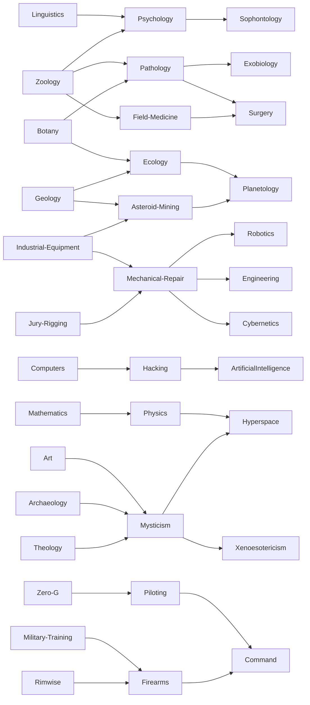

# Mothership RPG Generation Libraries

- [Mothership RPG Generation Libraries](#mothership-rpg-generation-libraries)
- [Character generation](#character-generation)
- [Wound generation](#wound-generation)
- [Items generation](#items-generation)
- [Skill Tree](#skill-tree)


# Character generation

```bash
❯ npm install @mothership-rpg/characters
```

```typescript
import { Character } from "@mothership-rpg/characters";

const character = new Character();
console.log(character);
```

<details><summary>Open to see console output</summary>

```typescript
Character {
  maxWounds: 2,
  skills: [
    TrainedSkill { name: 'Industrial Equipment', dependsOn: undefined },
    TrainedSkill { name: 'Zero-G', dependsOn: undefined },
    ExpertSkill { name: 'Pathology', dependsOn: [Array] },
    TrainedSkill { name: 'Botany', dependsOn: undefined }
  ],
  classType: Teamster {
    TRAUMA_RESPONSE: 'Once per session, you may take advantage on a panic check.'
  },
  saves: { sanity: 30, fear: 38, body: 23 },
  stats: { strength: 49, speed: 34, intellect: 50, combat: 38 },
  name: 'Jill Robel'
}
```

</details>

# Wound generation

```bash
❯ npm install @mothership-rpg/wounds
```

```typescript
import { Wound, BluntForce } from "@mothership-rpg/wounds";

const wound = new Wound(BluntForce);
console.log(wound.rollSeverity());
```

Output:

```typescript
Skull fracture. [-] on all rolls.
```

# Items generation

```bash
❯ npm install @mothership-rpg/items
```

```typescript
import { Armor, Equipment, Weapon } from "@mothership-rpg/items";

console.log(Armor.random);
console.log(Equipment.random);
console.log(Weapon.random);
```

Output:

```typescript
Armor {
  name: 'Hazard Suit',
  description: 'Includes air filter, extreme heat/cold protection, hydration reclamation (1L of water lasts 4 days), short-range comms, headlamp, and radiation shielding.',
  cost: 4000,
  special: 'Includes air filter, extreme heat/cold protection, hydration reclamation (1L of water lasts 4 days), short-range comms, headlamp, and radiation shielding.',
  armorPoints: 5
}
Equipment {
  name: 'Bioscanner',
  description: 'Long Range. Allows the user to scan for signs of life. Can tell the location of signs of life, but not what that life is. Blocked by some materials at the Warden’s discretion.',
  cost: 3000
}
Weapon {
  name: 'General-Purpose Machine Gun',
  description: 'Two-handed. Heavy. Barrel can be maneuvered to fire around corners.',
  cost: 45000,
  range: 'Long',
  damage: '4d10 DMG',
  shots: 5,
  wound: Wound {
    woundType: {
      '1': 'Grazed. Knocked down.',
      '2': 'Bleeding +1.',
      '3': 'Broken rib.',
      '4': 'Fractured extremity.',
      '5': 'Internal bleeding. Bleeding +2.',
      '6': 'Lodged bullet. Surgery required.',
      '7': 'Gunshot wound to the neck.',
      '8': 'Major blood loss. Bleeding +4.',
      '9': 'Sucking chest wound. Bleeding +5.',
      '10': 'Headshot. Death Save.',
      'Grazed. Knocked down.': 1,
      'Bleeding +1.': 2,
      'Broken rib.': 3,
      'Fractured extremity.': 4,
      'Internal bleeding. Bleeding +2.': 5,
      'Lodged bullet. Surgery required.': 6,
      'Gunshot wound to the neck.': 7,
      'Major blood loss. Bleeding +4.': 8,
      'Sucking chest wound. Bleeding +5.': 9,
      'Headshot. Death Save.': 10
    },
    advOrDisadv: 1,
    wound: undefined
  },
  special: 'Two-handed. Heavy. Barrel can be maneuvered to fire around corners.'
}
```


# Skill Tree
