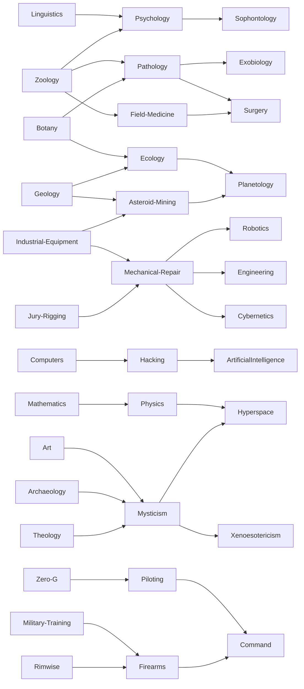

# character-generation

# Skill Tree

```mermaid
flowchart LR
    Linguistics --> Psychology
    Psychology --> Sophontology
    Zoology --> Psychology
    Zoology --> Pathology
    Pathology --> Exobiology
    Botany --> Pathology
    Pathology --> Surgery
    Zoology --> Field-Medicine
    Field-Medicine --> Surgery
    Botany --> Ecology
    Ecology --> Planetology
    Geology --> Ecology
    Geology --> Asteroid-Mining
    Asteroid-Mining --> Planetology
    Industrial-Equipment --> Asteroid-Mining
    Industrial-Equipment --> Mechanical-Repair
    Mechanical-Repair --> Robotics
    Jury-Rigging --> Mechanical-Repair
    Mechanical-Repair --> Engineering
    Mechanical-Repair --> Cybernetics
    Computers --> Hacking
    Hacking --> ArtificialIntelligence
    Mathematics --> Physics
    Physics --> Hyperspace
    Art --> Mysticism
    Mysticism --> Hyperspace
    Archaeology --> Mysticism
    Theology --> Mysticism
    Mysticism --> Xenoesotericism
    Zero-G --> Piloting
    Piloting --> Command
    Military-Training --> Firearms
    Firearms --> Command
    Rimwise --> Firearms
```