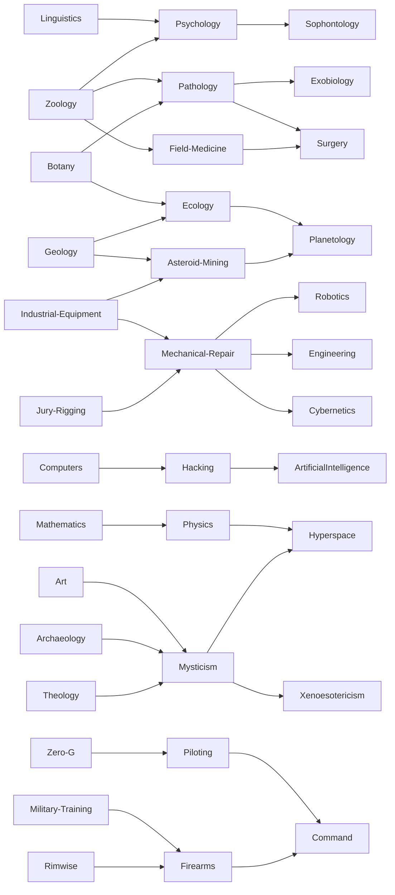

# character-generation

- [character-generation](#character-generation)
- [Character generation](#character-generation-1)
- [Wound generation](#wound-generation)
- [Skill Tree](#skill-tree)


# Character generation

```bash
❯ npm install @mothership-rpg/characters
```

```typescript
import { Character } from "@mothership-rpg/characters";

const character = new Character();
console.log(character);
```

<details><summary>Open to see console output</summary>

```typescript
Character {
  maxWounds: 2,
  skills: [
    TrainedSkill { name: 'Industrial Equipment', dependsOn: undefined },
    TrainedSkill { name: 'Zero-G', dependsOn: undefined },
    ExpertSkill { name: 'Pathology', dependsOn: [Array] },
    TrainedSkill { name: 'Botany', dependsOn: undefined }
  ],
  classType: Teamster {
    TRAUMA_RESPONSE: 'Once per session, you may take advantage on a panic check.'
  },
  saves: { sanity: 30, fear: 38, body: 23 },
  stats: { strength: 49, speed: 34, intellect: 50, combat: 38 },
  name: 'Jill Robel'
}
```

</details>

# Wound generation

```bash
❯ npm install @mothership-rpg/wounds
```

```typescript
import { Wound, BluntForce } from "@mothership-rpg/wounds";

const wound = new Wound(BluntForce);
console.log(wound.rollSeverity());
```

Output:

```typescript
Skull fracture. [-] on all rolls.
```


# Skill Tree
